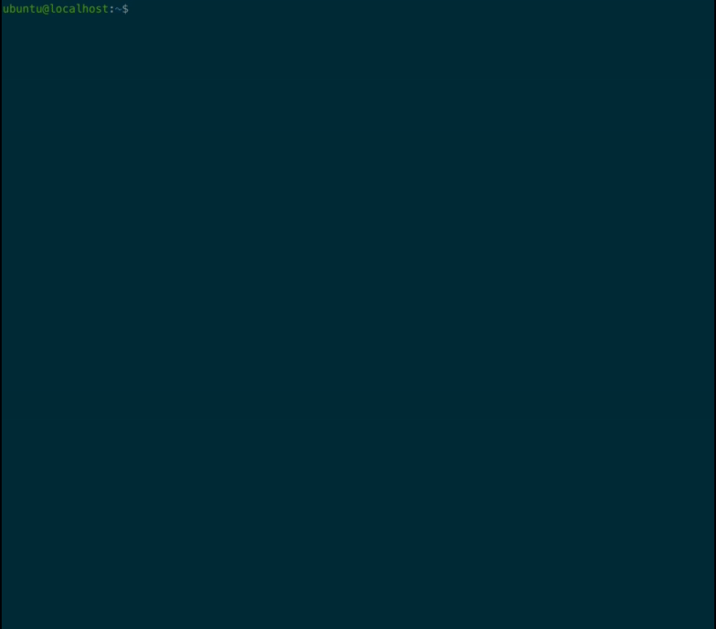

# CVEScan

<p align="center">
	<a href="https://github.com/canonical/sec-cvescan">
		
	</a>
	
	<a href="https://travis-ci.org/canonical/sec-cvescan">
		
	</a>
	
	<a href="https://snapcraft.io/cvescan">
		
	</a>
</p>

## About

CVEScan analyzes an Ubuntu system to check whether all available security
patches have been installed. CVEScan produces a clear, concise report that
tells you which, if any, security patches an Ubuntu system may be missing.

In addition to scanning a local system, CVEScan can [scan a package
manifest](#generating-and-scanning-a-manifest-file) file. This is useful in
environments where CVEScan cannot be installed on every system.

### Ubuntu Vulnerability Database JSON

The Ubuntu Security Team at Canonical regularly publishes a JSON file
containing information about security updates for `.deb` packages. The source of
the information is the [Ubuntu CVE
Tracker](https://people.canonical.com/~ubuntu-security/cve/). The information
contained in the JSON file is similar to the information published in the
[Ubuntu OVAL files](https://people.canonical.com/~ubuntu-security/oval/), but
the format is designed specifically for use by CVEScan.

### Regarding v2.0.0 and Later
v2.0.0 is a complete rewrite of CVEScan. It boasts a clear, concise reporting
format and a 10x performance improvement over v1.0.10. Additionally, this
rewrite will allow developers to add new features and capabilities more
quickly.

As might be expected with the release of a new major version, certain options
and features included with v1.0.10 may no longer be available or may not
function as they use to. If you absolutely must have the old version of
CVEScan, you can install the snap and run `cvescan.sh`. This will run the
deprecated v1.0.10 of CVEScan.

For more information about how v2.0.0 differs from v1.0.10, see the
[CHANGELOG](./CHANGELOG.md).

## Using CVEScan




### Options
CVEScan provides a number of options. See `cvescan -h` for more details.

```
$> cvescan -h

usage: cvescan [-h] [-c CVE-IDENTIFIER] [-p {critical,high,medium,all}] [-s]
               [-u UCT_FILE] [-m MANIFEST_FILE] [-n] [--show-links]
               [--unresolved] [-v] [-x]

Scan an Ubuntu system for known vulnerabilities.

optional arguments:
  -h, --help            show this help message and exit
  -c CVE-IDENTIFIER, --cve CVE-IDENTIFIER
                        Report if this system is vulnerable to a specific CVE.
  -p {critical,high,medium,all}, --priority {critical,high,medium,all}
                        'critical' = show only critical CVEs.
                        'high'     = show critical and high CVEs (default)
                        'medium'   = show critical and high and medium CVEs
                        'all'      = show all CVES (no filtering based on priority)
  -s, --silent          Enable script/Silent mode: To be used with '-c <cve-identifier>'.
                        Do not print text output; exit 0 if not vulnerable, exit 1 if vulnerable.
  --db UBUNTU_DB_FILE   Specify an Ubuntu vulnerability datbase file to use instead of downloading the
                        latest from people.canonical.com.
  -m MANIFEST_FILE, --manifest MANIFEST_FILE
                        Enable manifest mode. Do not scan the localhost. Instead, run a scan against the
                        specified package manifest file.
                        Note: Package manifest files can be generated by running
                              `dpkg-query -W > manifest.txt` on the host you wish to scan.
  -n, --nagios          Enable Nagios mode for use with NRPE.
                        Typical nagios-style "OK|WARNING|CRITICAL|UNKNOWN" messages
                         and exit codes of 0, 1, 2, or 3.
                        0/OK = not vulnerable to any known and patchable CVEs of the
                         specified priority or higher.
                        1/WARNING = vulnerable to at least one known CVE of the specified
                         priority or higher for which there is no available update.
                        2/CRITICAL = vulnerable to at least one known and patchable CVE of
                         the specified priority or higher.
                        3/UNKNOWN = something went wrong with the script, or oscap.
  --show-links          Provide links to the Ubuntu CVE Tracker for each CVE.
  --unresolved          Show CVEs that have not yet been resolved.
  -v, --verbose         Enable verbose messages.
  -x, --experimental    Enable eXperimental mode. Use experimental (also called "alpha") data
                        from the Ubuntu CVE tracker. The alpha UCT files include information about
                        package updates available for users of Ubuntu Advantage running systems
                        with ESM Apps and ESM Infra enabled.
```

### Generating and Scanning a Manifest File

A package manifest file can be generated by running
`dpkg-query -W > manifest.txt` on any Ubuntu system. The manifest file can be
copied to any system where CVEScan is installed. CVEScan can then generate
a report based on the manifest file instead of the local system: `cvescan -m
manifest.txt`

## Installation

### As a Snap

The recommended way to install CVEScan is with `sudo snap install cvescan`

### From Source
To install and run CVEScan from source, you'll first need to install some prerequsites:

```
$> sudo apt install python3-pip libcurl4-openssl-dev libssl-dev
```

Then you can clone this repository and install CVEScan:

```
$> git clone https://github.com/canonical/sec-cvescan
$> pip3 install --user sec-cvescan/
$> ~/.local/bin/cvescan
```

## Development

### Running from Source

CVEScan can be run from the source code with `python3 -m cvescan`

### Installing precommit hooks
To install the precommit hooks, run

    pip3 install --user pre-commit
    ~/.local/bin/pre-commit install

### Running the test suite
You can run the automated test suite by running

    python3 setup.py test

An HTML code coverage report will be generated at `./htmlcov`. You can view
this with any web browser (e.g. `firefox ./htmlcov/index.html`).
